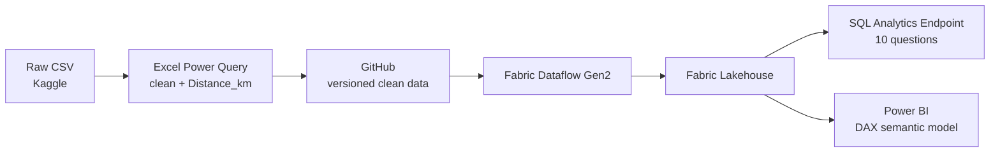

# 🍔 MealDash — Delivery Operations Analytics

**Diagnosing why delivery times vary across a 45,000+ order quick-commerce dataset using Excel, SQL, Microsoft Fabric, and Power BI, turning the findings into three specific, actionable recommendations.**

🔗 [Live Dashboard](https://app.fabric.microsoft.com/links/SJ5wVO19En?ctid=e93d71d6-b5c0-4b78-a861-d9964ecdfcd6&pbi_source=linkShare&bookmarkGuid=c964f109-a243-4282-9765-edfe9330625c) · 📄 [SQL Findings Report](Docs/SQL_Report.pdf) · 📐 [DAX Reference](Docs/MealDash_DAX_Measures.pdf)

## Table of Contents
- [Overview](#overview)
- [Problem Statement](#problem-statement)
- [Dataset Description](#dataset-description)
- [Tools & Technologies](#tools--technologies)
- [Architecture](#architecture)
- [Project Structure](#project-structure)
- [Data Cleaning & Preparation](#data-cleaning--preparation)
- [EDA & Key Insights](#eda--key-insights)
- [SQL Sample](#sql-sample)
- [DAX Sample](#dax-sample)
- [Dashboard](#dashboard)
- [How to Run This Project](#how-to-run-this-project)
- [Final Recommendations & Future Work](#final-recommendations--future-work)
- [Author & Contact](#author--contact)

## Overview

MealDash is a quick-commerce delivery operations analysis built on a real, approximately 45,000-order dataset. It follows a full analytics pipeline: Excel for cleaning, SQL for answering 10 defined business questions, Microsoft Fabric for a governed data pipeline, and Power BI for a 3-page live dashboard, ending in three specific, ops-actionable recommendations rather than open-ended observations.

## Problem Statement

Delivery times vary widely: some orders arrive in 10 minutes, others take almost an hour, with no quick, repeatable way to know why. Diagnosing a single slow week meant manually digging through raw data for a day or two. This project builds a repeatable pipeline that answers "why was it slow, and what can we do about it?" in minutes instead of days.

## Dataset Description

Approximately 45,000 real delivery orders (delivery timestamps, GPS coordinates, weather, traffic density, agent ratings, vehicle type, festival-day flag), no synthetic data. Source: [Zomato Delivery Operations Analytics Dataset, Kaggle](https://www.kaggle.com/datasets/saurabhbadole/zomato-delivery-operations-analytics-dataset). Raw and cleaned CSVs in [`Data/`](Data/).

## Tools & Technologies

| Tool | Role |
|---|---|
| **Excel (Power Query)** | Cleaning pass: nulls, formats, categorical standardization, Haversine `Distance_km` column |
| **SQL** (Fabric SQL Analytics Endpoint) | Answered all 10 business questions using CTEs, CASE bucketing, window functions |
| **Microsoft Fabric** (Lakehouse + Dataflow Gen2) | Governed, repeatable pipeline from GitHub into a Lakehouse |
| **Power BI** | 3-page live dashboard, DAX measures, same semantic model as SQL layer |
| **Git / GitHub** | Version control, project hosting |

## Architecture



SQL and Power BI sit on the same semantic model, so a number in the SQL report and a number on the dashboard never drift apart.

## Project Structure

```
MealDash/
├── Dashboard/
│   ├── Mealdash_Dashboard.pbix
│   ├── Mealdash_Dashboard.pbit
│   └── Mealdash_Dashboard.pdf
├── Data/
│   ├── Clean/MealDash_Clean.csv
│   └── Raw/Raw_Data.csv
├── Docs/
│   ├── MealDash_BRD.pdf
│   ├── MealDash_DAX_Measures.pdf
│   ├── MealDash_Presentation.pdf/.pptx
│   └── SQL_Report.pdf
├── Excel_Analysis/
│   ├── MealDash_Excel_Analysis.xlsx
│   └── Charts.png, Pivot.png
├── SQL/
│   └── Q1_...sql to Q10_...sql
├── Screenshots/
│   └── Overview.png, DeepDive.png, TrendOverTime.png, Fabric.png
├── LICENSE
└── README.md
```

## Data Cleaning & Preparation

- Handled nulls and inconsistent formats in Excel Power Query
- Standardized categorical fields (city type, weather, traffic density)
- Calculated straight-line delivery distance (`Distance_km`) from GPS coordinates via the Haversine formula
- Version-controlled the cleaned dataset on GitHub, loaded into a Fabric Lakehouse via Dataflow Gen2 instead of a one-time manual upload

## EDA & Key Insights

Each of the 10 business questions was answered in SQL and reported alongside its sample size. Full reasoning: [SQL Findings Report](Docs/SQL_Report.pdf).

| # | Question | Finding |
|---|---|---|
| 1 | Overall delivery time | 26 min average, 10 to 54 min range |
| 2 | Slowest city | Metropolitan slowest by volume (27 min, 34,000+ orders) |
| 3 | Traffic impact | Jam adds about 10 min vs. Low traffic |
| 4 | Weather impact | Fog and Cloudy slowest (28 min), not storms as expected |
| 5 | Distance impact | Biggest time cost is crossing the 5 km mark, then plateaus |
| 6 | Vehicle type impact | Minor effect (about 3 min) |
| 7 | Agent rating impact | **4.5+ rated agents are 10 to 13 min faster** |
| 8 | Bundled orders impact | **2 to 3 bundled orders more than doubles delivery time** |
| 9 | Festival impact | **Festival days are 75 to 80% slower** than normal days |
| 10 | Trend over time | Flat, no long-term drift; patterns are structural |

## SQL Sample

Question 9, festival-day impact, showing the CASE/aggregation pattern used across all 10 queries:

```sql
-- Q9: Are festival days slower than normal days?
SELECT
    Festival,
    COUNT(*)                       AS order_count,
    AVG(Time_taken_min)            AS avg_delivery_time,
    PERCENTILE_CONT(0.5) WITHIN GROUP (ORDER BY Time_taken_min)
                                    AS median_delivery_time
FROM MealDash_Clean
GROUP BY Festival;
```

Question 7, agent rating impact, using bucketed CASE logic:

```sql
-- Q7: Do higher-rated agents deliver faster?
SELECT
    CASE
        WHEN Delivery_person_Ratings >= 4.5 THEN '4.5+'
        WHEN Delivery_person_Ratings >= 4.0 THEN '4.0-4.49'
        WHEN Delivery_person_Ratings >= 3.5 THEN '3.5-3.99'
        ELSE 'Below 3.5'
    END                             AS rating_bucket,
    COUNT(*)                        AS order_count,
    AVG(Time_taken_min)             AS avg_delivery_time
FROM MealDash_Clean
GROUP BY 1
ORDER BY avg_delivery_time;
```

Full set, one file per question: [`SQL/`](SQL/).

## DAX Sample

Festival impact, comparing festival vs. normal-day averages behind the Page 1 KPI card:

```dax
Festival Avg Time =
CALCULATE(
    AVERAGE(MealDash_Clean[Time_taken _min_]),
    MealDash_Clean[Festival] = "Yes"
)

Normal Day Avg Time =
CALCULATE(
    AVERAGE(MealDash_Clean[Time_taken _min_]),
    MealDash_Clean[Festival] = "No"
)

Festival Impact % =
DIVIDE([Festival Avg Time] - [Normal Day Avg Time], [Normal Day Avg Time])
```

7-day rolling average behind the Page 3 trend line:

```dax
Rolling 7Day Avg =
AVERAGEX(
    DATESINPERIOD(MealDash_Clean[Order_Date], MAX(MealDash_Clean[Order_Date]), -7, DAY),
    CALCULATE(AVERAGE(MealDash_Clean[Time_taken _min_]))
)
```

Full measure list, 21 measures and columns: [`Docs/MealDash_DAX_Measures.pdf`](Docs/MealDash_DAX_Measures.pdf).

## Dashboard

3-page Power BI dashboard on the same semantic model as the SQL layer:

- **Page 1, Executive Overview:** total orders, avg delivery time, festival impact %, slow-delivery rate
- **Page 2, Delivery Drivers Deep Dive:** distance, rating, vehicle condition, bundling, all slicer-driven
- **Page 3, Trend Over Time:** daily averages smoothed with a 7-day rolling average


🔗 [Open the Live Interactive Dashboard](https://app.fabric.microsoft.com/links/SJ5wVO19En?ctid=e93d71d6-b5c0-4b78-a861-d9964ecdfcd6&pbi_source=linkShare&bookmarkGuid=c964f109-a243-4282-9765-edfe9330625c) *(Microsoft sign-in required; static export also available: [Mealdash_Dashboard.pdf](Dashboard/Mealdash_Dashboard.pdf))*

## How to Run This Project

1. Clone the repo: `git clone https://github.com/seema-kri/MealDash.git`
2. Explore raw and cleaned CSVs in [`Data/`](Data/)
3. Run the SQL queries in [`SQL/`](SQL/), one file per question, built for Fabric's SQL Analytics Endpoint, works on standard T-SQL/PostgreSQL with minor adjustments
4. Open the dashboard via the [live link](https://app.fabric.microsoft.com/links/SJ5wVO19En?ctid=e93d71d6-b5c0-4b78-a861-d9964ecdfcd6&pbi_source=linkShare&bookmarkGuid=c964f109-a243-4282-9765-edfe9330625c) or `Dashboard/Mealdash_Dashboard.pbix` in Power BI Desktop
5. Full reasoning in [`Docs/`](Docs/): BRD, SQL Findings Report, DAX reference

## Final Recommendations & Future Work

**Recommendations**
1. **Pre-plan festival-day staffing.** Festival deliveries take 75 to 80% longer, the single largest effect found. Low volume (896 orders) makes this high-ROI, low-effort.
2. **Cap bundled deliveries at 1 extra order.** 2 to 3 bundled orders more than doubles delivery time (22 to 47 min), with non-linear cost growth.
3. **Use agent ratings for order routing.** 4.5+ rated agents deliver 10+ minutes faster than every lower bucket.

**Future Work**
- Validate the festival-day effect against a full year of festival dates
- Replace straight-line (Haversine) distance with actual road-route distance
- Investigate the direction of causation between agent rating and delivery speed
- Add a live data connection for ongoing monitoring, not one-time diagnosis

## Author & Contact

**Seema Kumari**, Data Analyst
📧 [seemakri136@gmail.com](mailto:seemakri136@gmail.com) · 🔗 [LinkedIn](https://linkedin.com/in/seema-kumari-375763308) · 📊 [Live Dashboard](https://app.fabric.microsoft.com/links/SJ5wVO19En?ctid=e93d71d6-b5c0-4b78-a861-d9964ecdfcd6&pbi_source=linkShare&bookmarkGuid=c964f109-a243-4282-9765-edfe9330625c)
