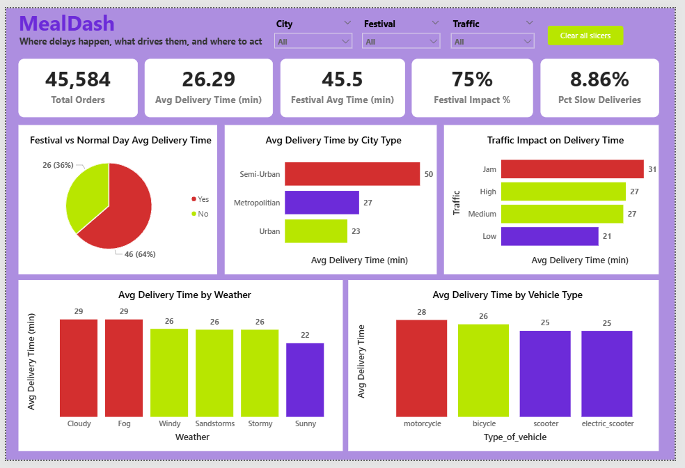
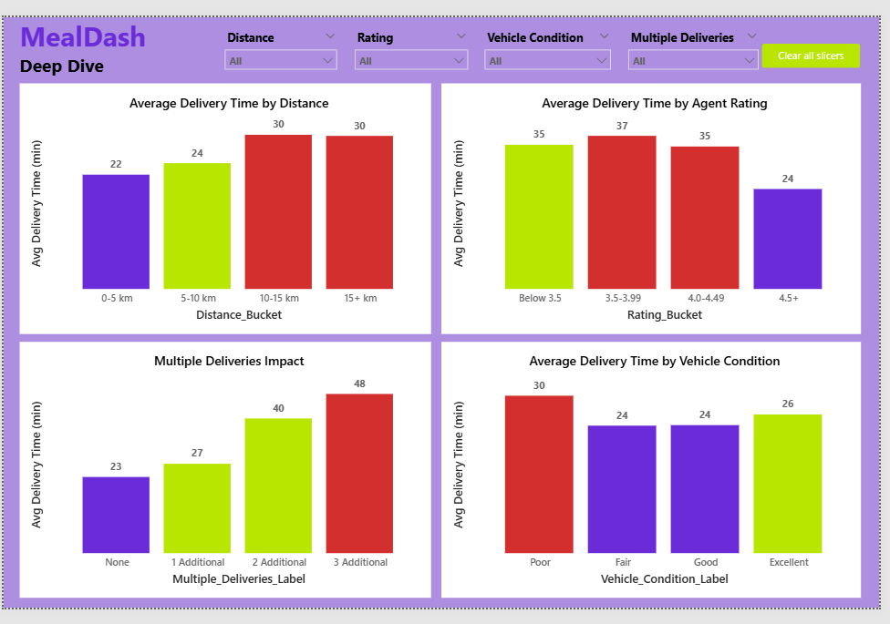
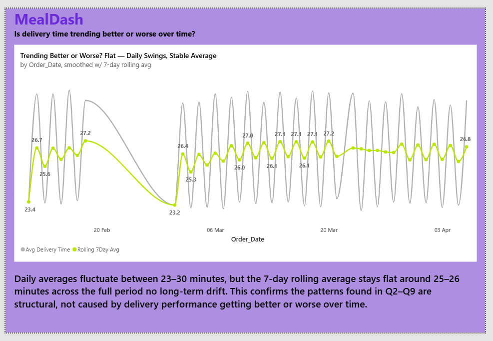

# 🍔 MealDash — Delivery Operations Analytics

**Diagnosing why delivery times vary across a 45,000+ order quick-commerce dataset, and turning it into three specific, actionable recommendations, using Excel, SQL, Microsoft Fabric, and Power BI.**

[](https://app.fabric.microsoft.com/links/SJ5wVO19En?ctid=e93d71d6-b5c0-4b78-a861-d9964ecdfcd6&pbi_source=linkShare&bookmarkGuid=c964f109-a243-4282-9765-edfe9330625c)


🔗 **[Open the Live Interactive Dashboard →](https://app.fabric.microsoft.com/links/SJ5wVO19En?ctid=e93d71d6-b5c0-4b78-a861-d9964ecdfcd6&pbi_source=linkShare&bookmarkGuid=c964f109-a243-4282-9765-edfe9330625c)**

---

## 📑 Table of Contents

- [Business Problem](#-business-problem)
- [Dataset](#-dataset)
- [Tools & Technologies](#️-tools--technologies)
- [Project Structure](#-project-structure)
- [Approach](#-approach)
- [Key Insights](#-key-insights)
- [Dashboard Preview](#-dashboard-preview)
- [Recommendations](#-recommendations)
- [How to Run This Project](#️-how-to-run-this-project)
- [Future Work](#-future-work)
- [Connect](#-connect)

---

## 🎯 Business Problem

MealDash's delivery times vary widely. Some orders arrive in 10 minutes, others take almost an hour, and there was no quick, repeatable way to know **why**. Diagnosing a slow week meant manually digging through raw data for a day or two, with no standing answer to "why was it slow?"

This project answers **10 specific business questions** (full scope in the [Business Requirements Document](Docs/MealDash_BRD.pdf)), moving from the overall scale of the problem, to the levers ops can control (traffic, distance, staffing, order bundling) versus the ones they can't (weather), and finally to whether performance is trending better or worse over time. The result is a governed, repeatable pipeline that answers the same questions in minutes instead of days.

## 📦 Dataset

A real, public delivery-operations dataset of **~45,000 orders**, including delivery timestamps, GPS coordinates, weather conditions, traffic density, delivery agent ratings, vehicle type, and festival-day flags. No synthetic data was used. Every finding is grounded in real, messy, imperfect data that was cleaned and validated before any conclusion was drawn.

📥 **Source:** [Zomato Delivery Operations Analytics Dataset — Kaggle](https://www.kaggle.com/datasets/saurabhbadole/zomato-delivery-operations-analytics-dataset)

## 🛠️ Tools & Technologies

| Tool | Role in This Project |
|---|---|
| **Excel (Power Query)** | First cleaning pass: nulls, formats, categorical standardization, and a Haversine-based `Distance_km` column |
| **SQL** (Fabric SQL Analytics Endpoint) | Answered all 10 business questions using CTEs, CASE-based bucketing, and window functions (`PERCENTILE_CONT`, rolling averages) |
| **Microsoft Fabric** (Lakehouse + Dataflow Gen2) | Built a repeatable, governed pipeline that pulls cleaned data from GitHub via Dataflow Gen2 into a Lakehouse, instead of a one-off manual upload |
| **Power BI** | 3-page live, interactive dashboard with DAX measures, built on the same governed semantic model as the SQL layer |

## 📂 Project Structure

```
MealDash/
├── Dashboard/
│   ├── Mealdash_Dashboard.pbit
│   ├── Mealdash_Dashboard.pbix
│   ├── Mealdash_Dashboard.pdf
│   └── README.md
├── Data/
│   ├── Clean/
│   │   ├── MealDash_Clean.csv
│   │   └── README.md
│   ├── Raw/
│   │   ├── Raw_Data.csv
│   │   └── README.md
│   └── README.md
├── Docs/
│   ├── MealDash_BRD.pdf
│   ├── SQL_Report.pdf
│   └── README.md
├── Excel_Analysis/
│   ├── Charts.png
│   ├── MealDash_Excel_Analysis.xlsx
│   ├── Pivot.png
│   └── README.md
├── SQL/
│   ├── MyQueries.zip
│   └── README.md
├── Screenshots/
│   ├── Overview.png
│   ├── DeepDive.png
│   ├── TrendOverTime.png
│   ├── Fabric.png
│   ├── FabricMealDash.png
│   ├── DataFlow Gen2.png
│   ├── Charts.png
│   ├── Pivot.png
│   └── README.md
├── LICENSE
└── README.md
```

## 🔍 Approach

1. **Cleaned** raw delivery data in Excel Power Query: handled nulls, fixed inconsistent formats, standardized categories, and calculated straight-line delivery distance from GPS coordinates using the Haversine formula.
2. **Version-controlled** the cleaned dataset on GitHub, so the pipeline pulls from a refreshable source rather than a static one-time upload.
3. **Loaded** the data into a Microsoft Fabric Lakehouse via Dataflow Gen2, keeping the pipeline repeatable and governed.
4. **Answered all 10 business questions in SQL** against the Fabric SQL Analytics Endpoint. Every average is reported alongside its sample size, so no finding is trusted blindly. Full reasoning for each query is documented in the [SQL Findings Report](Docs/SQL_Report.pdf).
5. **Built a 3-page live Power BI dashboard** on the same semantic model, so the visuals and the SQL findings are always consistent with each other.

## 💡 Key Insights

| # | Question | Finding |
|---|---|---|
| 1 | Overall delivery time | 26 min average, 10–54 min range |
| 2 | Slowest city | Metropolitan slowest by volume (27 min, 34,000+ orders) |
| 3 | Traffic impact | Jam adds ~10 min vs. Low traffic |
| 4 | Weather impact | Fog/Cloudy slowest (28 min), not storms as expected |
| 5 | Distance impact | Biggest time cost is crossing the 5 km mark, then plateaus |
| 6 | Vehicle type impact | Minor effect (~3 min) |
| 7 | Agent rating impact | **4.5+ rated agents are 10–13 min faster** |
| 8 | Bundled orders impact | **2–3 bundled orders more than doubles delivery time** |
| 9 | Festival impact | **Festival days are 75–80% slower** than normal days |
| 10 | Trend over time | Flat, no long-term drift; patterns are structural |

📄 Full reasoning, SQL code, and confidence levels for every finding: **[SQL Findings Report](Docs/SQL_Report.pdf)**

## 📊 Dashboard Preview

**Page 1 — Executive Overview**


**Page 2 — Delivery Drivers Deep Dive**


**Page 3 — Trend Over Time**


🔗 **[Open the live, interactive dashboard →](https://app.fabric.microsoft.com/links/SJ5wVO19En?ctid=e93d71d6-b5c0-4b78-a861-d9964ecdfcd6&pbi_source=linkShare&bookmarkGuid=c964f109-a243-4282-9765-edfe9330625c)**

## ✅ Recommendations

Three findings stand out as the largest, most actionable, and least ambiguous. These are the ones I'd act on first if I had five minutes with the operations team:

### 1. 🎯 Pre-plan festival-day staffing
Festival-day deliveries take **75–80% longer** than normal days, the single largest effect found across all 10 questions, based on 45,000+ orders. Low order volume (896 orders) but high delay impact makes this a high-ROI, low-effort fix: targeted staffing on known festival dates, not a company-wide change.

### 2. 📦 Cap bundled deliveries at 1 extra order
Handling 2–3 orders in one trip **more than doubles** delivery time (22 min → 47 min), and the cost accelerates non-linearly: the jump from 1 to 2 bundled orders is worse than 0 to 1. Capping bundling at 1 extra order for time-sensitive deliveries captures most of the efficiency without the steep time penalty.

### 3. ⭐ Use agent ratings for order routing
Agents rated 4.5+ deliver in **24 minutes on average**, while every lower-rated bucket sits at 34–37 minutes, a 10+ minute gap that holds regardless of how far below 4.5 the rating is. Rating is a strong, easy-to-access signal for prioritizing time-sensitive orders, even though causation (does rating drive speed, or does speed drive rating?) isn't fully resolved by this data alone.

> *Traffic and weather matter too, but they're conditions ops can't directly control. These three are things ops can act on this week.*

## ▶️ How to Run This Project

1. **Clone this repository**
   ```bash
   git clone https://github.com/seema-kri/MealDash.git
   ```
2. **Explore the data**: raw and cleaned CSVs are in [`Data/`](Data/) (original source: [Kaggle dataset](https://www.kaggle.com/datasets/saurabhbadole/zomato-delivery-operations-analytics-dataset))
3. **Run the SQL queries**: all 10 business-question queries are in [`SQL/MyQueries.zip`](SQL/MyQueries.zip); run against any SQL engine (originally built for Fabric's SQL Analytics Endpoint, works on standard T-SQL/PostgreSQL with minor syntax adjustments)
4. **Open the dashboard**
   - View instantly via the **[live link](https://app.fabric.microsoft.com/links/SJ5wVO19En?ctid=e93d71d6-b5c0-4b78-a861-d9964ecdfcd6&pbi_source=linkShare&bookmarkGuid=c964f109-a243-4282-9765-edfe9330625c)**, or
   - Open [`Dashboard/Mealdash_Dashboard.pbix`](Dashboard/Mealdash_Dashboard.pbix) in Power BI Desktop
5. **Read the full reasoning**: [BRD](Docs/MealDash_BRD.pdf) for project scope, [SQL Findings Report](Docs/SQL_Report.pdf) for query-by-query analysis and recommendations

## 🚀 Future Work

- Validate the festival-day effect against a full year of festival dates, not just this dataset's window
- Replace straight-line (Haversine) distance with actual road-route distance for more precise distance analysis
- Investigate the direction of causation between agent rating and delivery speed (does rating predict speed, or does speed drive rating?)
- Add a live/real-time data connection instead of a static historical dataset, to support ongoing monitoring rather than one-time diagnosis

---

## 📫 Connect

<p align="center">
  <a href="https://linkedin.com/in/seema-kumari-375763308">
    
  </a>
  <a href="mailto:seemakri136@gmail.com">
    
  </a>
  <a href="https://app.fabric.microsoft.com/links/SJ5wVO19En?ctid=e93d71d6-b5c0-4b78-a861-d9964ecdfcd6&pbi_source=linkShare&bookmarkGuid=c964f109-a243-4282-9765-edfe9330625c">
    
  </a>
</p>

<p align="center">
  <em>Open to opportunities, collaborations, and conversations around data analytics.</em>
</p>
