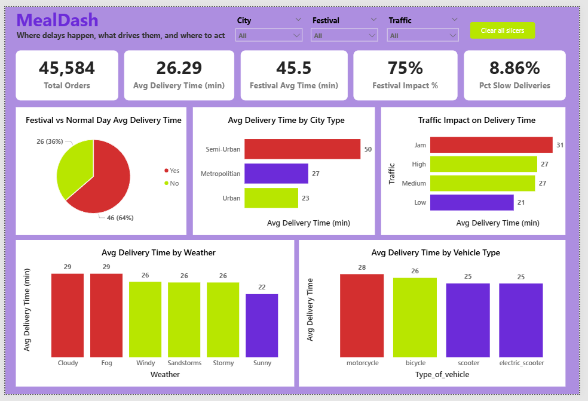
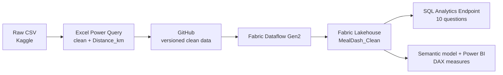
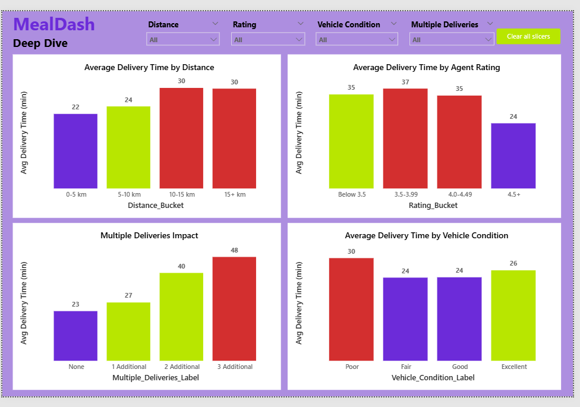
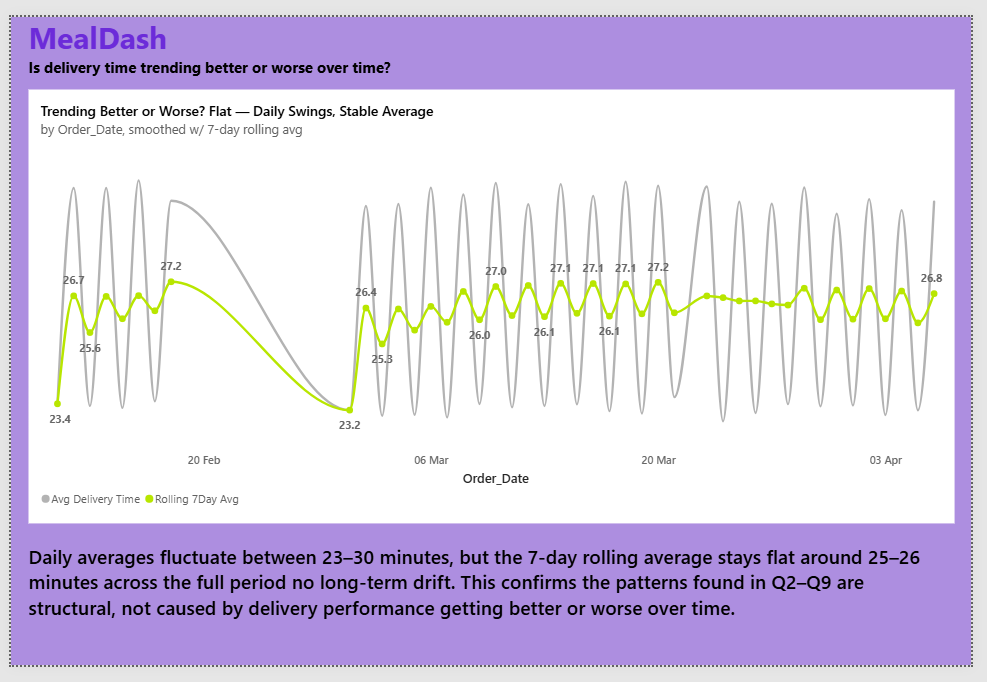

# MealDash: Delivery Operations Analytics

Diagnosing why delivery times vary across 45,584 quick-commerce orders using Excel, SQL, Microsoft Fabric and Power BI, and turning the findings into three actionable recommendations.

🔗 [Live Dashboard](https://app.fabric.microsoft.com/links/SJ5wVO19En?ctid=e93d71d6-b5c0-4b78-a861-d9964ecdfcd6&pbi_source=linkShare&bookmarkGuid=c964f109-a243-4282-9765-edfe9330625c) · 📄 [Business Requirements](Docs/MealDash_BRD.pdf) · 📽️ [Presentation](Docs/MealDash_Presentation.pdf) · 🧾 [SQL Findings Report](Docs/SQL_Report.pdf) · 📐 [DAX Reference](Docs/MealDash_DAX_Measures.pdf)




## Table of Contents

- [Overview](#overview)
- [Problem Statement](#problem-statement)
- [Dataset Description](#dataset-description)
- [Tools & Technologies](#tools--technologies)
- [Architecture](#architecture)
- [Project Structure](#project-structure)
- [Data Cleaning & Preparation](#data-cleaning--preparation)
- [EDA & Key Insights](#eda--key-insights)
- [SQL Sample](#sql-sample)
- [DAX Sample](#dax-sample)
- [Dashboard](#dashboard)
- [How to Run This Project](#how-to-run-this-project)
- [Final Recommendations & Future Work](#final-recommendations--future-work)
- [Author & Contact](#author--contact)

## Overview

End-to-end delivery operations analysis. Excel Power Query cleans the data, GitHub versions it, a Fabric Dataflow Gen2 loads it into a Lakehouse, SQL answers 10 defined business questions, and a 3-page Power BI dashboard lets ops explore the results. The project ends in three recommendations ops can act on, not open-ended observations.

## Problem Statement

Delivery times vary widely: some orders arrive in 10 minutes, others take almost an hour. Diagnosing one slow week meant an analyst digging through raw records for a day or two, with no standing answer to the question ops kept asking: "Why was it slow, and what can we do about it?"

This project builds a repeatable pipeline and dashboard so that question can be answered in minutes. Full scope and requirements: [Business Requirements Document](Docs/MealDash_BRD.pdf).

## Dataset Description

| Item | Detail |
|---|---|
| Source | [Zomato Delivery Operations Analytics Dataset, Kaggle](https://www.kaggle.com/datasets/saurabhbadole/zomato-delivery-operations-analytics-dataset) |
| Records | 45,584 orders |
| Fields | Delivery timestamps, GPS coordinates, weather, road traffic density, agent ratings, vehicle type and condition, multiple deliveries flag, festival flag, city type |
| Delivery time | 10 to 54 min, average 26.3 min |
| Files | Raw and cleaned CSVs in [`Data/`](Data/) |

Note: the dataset has no promised delivery time field, so the slow-delivery rate (8.86%) is benchmarked against segment averages, not a formal SLA target.

## Tools & Technologies

| Tool | Role |
|---|---|
| **Excel (Power Query)** | Cleaning: nulls, formats, category standardization, Haversine `Distance_km` column |
| **SQL** (Fabric SQL Analytics Endpoint) | 10 business questions using aggregation, CASE bucketing and a window function (7-day rolling average) |
| **Microsoft Fabric** (Lakehouse, Dataflow Gen2) | Repeatable pipeline from GitHub into a Lakehouse |
| **Power BI** | 3-page dashboard and DAX measures on a semantic model over the Lakehouse table |
| **Git / GitHub** | Version control and hosting |

## Architecture


```mermaid
flowchart LR
    A[Raw CSV<br/>Kaggle] --> B[Excel Power Query<br/>clean + Distance_km]
    B --> C[GitHub<br/>versioned clean data]
    C --> D[Fabric Dataflow Gen2]
    D --> E[Fabric Lakehouse<br/>MealDash_Clean]
    E --> F[SQL Analytics Endpoint<br/>10 questions]
    E --> G[Semantic model + Power BI<br/>DAX measures]
```

SQL and Power BI both read the same Lakehouse table, `MealDash_Clean`.

## Project Structure

```
MealDash/
├── Dashboard/
│   ├── Mealdash_Dashboard.pbix
│   ├── Mealdash_Dashboard.pbit
│   └── Mealdash_Dashboard.pdf
├── Data/
│   ├── Clean/MealDash_Clean.csv
│   └── Raw/Raw_Data.csv
├── Docs/
│   ├── MealDash_BRD.pdf
│   ├── MealDash_DAX_Measures.pdf
│   ├── MealDash_Presentation.pdf
│   ├── MealDash_Presentation.pptx
│   └── SQL_Report.pdf
├── Excel_Analysis/
│   ├── MealDash_Excel_Analysis.xlsx
│   ├── Charts.png
│   └── Pivot.png
├── SQL/
│   ├── Q1_Avg_Min_Max_Delivery_Time.sql
│   ├── Q2_City_AvgDeliveryTime.sql
│   ├── Q3_Traffic_AvgDeliveryTime.sql
│   ├── Q4_Weather_AvgDeliveryTime.sql
│   ├── Q5_Distance_AvgDeliveryTime.sql
│   ├── Q6_VehicleType_AvgDeliveryTime.sql
│   ├── Q7_Ratings_AvgDeliveryTime.sql
│   ├── Q8_MultipleDeliveries_AvgDeliveryTime.sql
│   ├── Q9_Festival_AvgDeliveryTime.sql
│   └── Q10_Trend_RollingAvgDeliveryTime.sql
├── Screenshots/
│   ├── Overview.png
│   ├── DeepDive.png
│   ├── TrendOverTime.png
│   └── Fabric.png
├── LICENSE
└── README.md
```

## Data Cleaning & Preparation

- Handled nulls and inconsistent formats in Excel Power Query.
- Standardized categorical fields (city type, weather, traffic density).
- Calculated straight-line delivery distance (`Distance_km`) from GPS coordinates with the Haversine formula.
- Versioned the cleaned data on GitHub and loaded it into a Fabric Lakehouse through Dataflow Gen2, instead of a one-time manual upload.

## EDA & Key Insights

Each question was answered in SQL. Full reasoning: [SQL Findings Report](Docs/SQL_Report.pdf).

| # | Question | Finding |
|---|---|---|
| 1 | Overall delivery time | 26.3 min average, 10 to 54 min range |
| 2 | City type | Semi-Urban is slowest at about 50 min. Metropolitan (27 min) holds most orders (34,000+). Urban is fastest (23 min) |
| 3 | Traffic | Jam is about 10 min slower than Low traffic (31 vs 21 min) |
| 4 | Weather | Fog and Cloudy slowest (about 29 min). Storms are not the worst |
| 5 | Distance | Biggest jump comes when crossing 5 km (22 to 24 min, then about 30 min), then it plateaus |
| 6 | Vehicle type | Small effect: about 3 min between fastest and slowest |
| 7 | Agent rating | **4.5+ rated agents average 24 min vs 35 to 37 min for lower buckets** |
| 8 | Multiple deliveries | **Each extra order adds time: 23 min (none), 27, 40, 48 min (3 extra)** |
| 9 | Festival | **Festival days average 45.5 min, about 75% slower than normal days** |
| 10 | Trend | 7-day rolling average stays roughly flat (about 25 to 27 min), so patterns are structural |

Bundling (3 extra orders vs none) and Semi-Urban (vs Urban) show gaps of about 2x, comparable to or larger than the festival effect in relative terms. Festival days stand out because the effect is predictable by date, though they are only 896 orders (about 2% of volume).

These are associations. Faster agents may also get easier orders, and festival days may differ in other ways.

## SQL Sample

Real queries from [`SQL/`](SQL/), one file per question.

Q7, agent rating impact (CASE bucketing):

```sql
--Do higher-rated delivery agents deliver faster?
SELECT 
    CASE 
        WHEN Delivery_person_Ratings >= 4.5 THEN '4.5+'
        WHEN Delivery_person_Ratings >= 4.0 THEN '4.0-4.49'
        WHEN Delivery_person_Ratings >= 3.5 THEN '3.5-3.99'
        ELSE 'Below 3.5'
    END AS Rating_Bucket,
    AVG([Time_taken _min_]) AS Avg_Delivery_Time,
    COUNT(*) AS Total_Orders
FROM MealDash_Clean
WHERE Delivery_person_Ratings IS NOT NULL
GROUP BY 
    CASE 
        WHEN Delivery_person_Ratings >= 4.5 THEN '4.5+'
        WHEN Delivery_person_Ratings >= 4.0 THEN '4.0-4.49'
        WHEN Delivery_person_Ratings >= 3.5 THEN '3.5-3.99'
        ELSE 'Below 3.5'
    END
ORDER BY Rating_Bucket DESC;
```

Q10, daily average with a 7-day rolling average (window function):

```sql
--Is delivery time trending better or worse over time?
SELECT 
    Order_Date,
    AVG([Time_taken _min_]) AS Daily_Avg_Delivery_Time,
    AVG(AVG([Time_taken _min_])) OVER (
        ORDER BY Order_Date 
        ROWS BETWEEN 6 PRECEDING AND CURRENT ROW
    ) AS Rolling_7Day_Avg
FROM MealDash_Clean
GROUP BY Order_Date
ORDER BY Order_Date;
```

## DAX Sample

Festival impact, behind the Page 1 KPI cards:

```dax
Festival Avg Time =
CALCULATE(
    AVERAGE(MealDash_Clean[Time_taken _min_]),
    MealDash_Clean[Festival] = "Yes"
)

Normal Day Avg Time =
CALCULATE(
    AVERAGE(MealDash_Clean[Time_taken _min_]),
    MealDash_Clean[Festival] = "No"
)

Festival Impact % =
DIVIDE([Festival Avg Time] - [Normal Day Avg Time], [Normal Day Avg Time])
```

7-day rolling average behind the Page 3 trend line:

```dax
Rolling 7Day Avg =
AVERAGEX(
    DATESINPERIOD(MealDash_Clean[Order_Date], MAX(MealDash_Clean[Order_Date]), -7, DAY),
    CALCULATE(AVERAGE(MealDash_Clean[Time_taken _min_]))
)
```

Full measure list: [`Docs/MealDash_DAX_Measures.pdf`](Docs/MealDash_DAX_Measures.pdf).

## Dashboard

Three pages on the same Lakehouse data as the SQL layer, built for self-serve exploration.

**Page 1, Executive Overview.** 45,584 total orders, 26.29 min average delivery time, festival average 45.5 min, festival impact 75%, slow-delivery rate 8.86%. Slicers for City, Festival and Traffic.


**Page 2, Delivery Drivers Deep Dive.** Distance, agent rating, vehicle condition and multiple deliveries, each slicer-driven.



**Page 3, Trend Over Time.** Daily averages with a 7-day rolling average to separate noise from signal.



🔗 [Open the live dashboard](https://app.fabric.microsoft.com/links/SJ5wVO19En?ctid=e93d71d6-b5c0-4b78-a861-d9964ecdfcd6&pbi_source=linkShare&bookmarkGuid=c964f109-a243-4282-9765-edfe9330625c) (Microsoft sign-in required). Static export: [Mealdash_Dashboard.pdf](Dashboard/Mealdash_Dashboard.pdf)

## How to Run This Project

1. Clone the repo:
   ```bash
   git clone https://github.com/seema-kri/MealDash.git
   cd MealDash
   ```
2. Explore the raw and cleaned CSVs in [`Data/`](Data/).
3. Load `Data/Clean/MealDash_Clean.csv` into a Fabric Lakehouse as table `MealDash_Clean` (Dataflow Gen2 or direct upload).
4. Run the queries in [`SQL/`](SQL/) on the Lakehouse SQL Analytics Endpoint. They are T-SQL and may need small changes elsewhere.
5. Open `Dashboard/Mealdash_Dashboard.pbix` in Power BI Desktop, or use the live link above.
6. Read the reasoning in [`Docs/`](Docs/): BRD, SQL Findings Report, DAX reference.

## Final Recommendations & Future Work

**Recommendations**

1. **Pre-plan festival-day staffing.** Festival orders average 45.5 min vs about 26 min on normal days. At 896 orders the total excess is roughly 17,500 delivery minutes, and festival dates are known in advance, so staffing can be targeted instead of company-wide.
2. **Limit bundling to 1 extra order for time-sensitive deliveries.** Average time rises from 23 min (no bundle) to 27, 40 and 48 min as extra orders are added. One extra order costs about 4 min, the second adds 13 more.
3. **Prioritize 4.5+ rated agents for time-sensitive orders.** They average 24 min vs 35 to 37 min for lower buckets. This is an association: agent rating and order difficulty may be linked, so test before changing routing for everyone.

Traffic and weather also matter, but ops cannot control them directly.

**Future work**

- Validate the festival effect against a full year of festival dates.
- Replace straight-line (Haversine) distance with road-route distance.
- Investigate whether agent rating causes faster delivery or only correlates with it.
- Add a live data connection for ongoing monitoring.
- Quantify Semi-Urban volume and a cost per delivery minute, to rank fixes by money.

## Author & Contact

**Seema Kumari**, Data Analyst

📧 [seemakri136@gmail.com](mailto:seemakri136@gmail.com) · 🔗 [LinkedIn](https://linkedin.com/in/seema-kumari-375763308) · 📊 [Live Dashboard](https://app.fabric.microsoft.com/links/SJ5wVO19En?ctid=e93d71d6-b5c0-4b78-a861-d9964ecdfcd6&pbi_source=linkShare&bookmarkGuid=c964f109-a243-4282-9765-edfe9330625c)

Open to opportunities, collaborations and conversations around data analytics.

⭐ If you found this project helpful, please consider giving it a star on GitHub.
